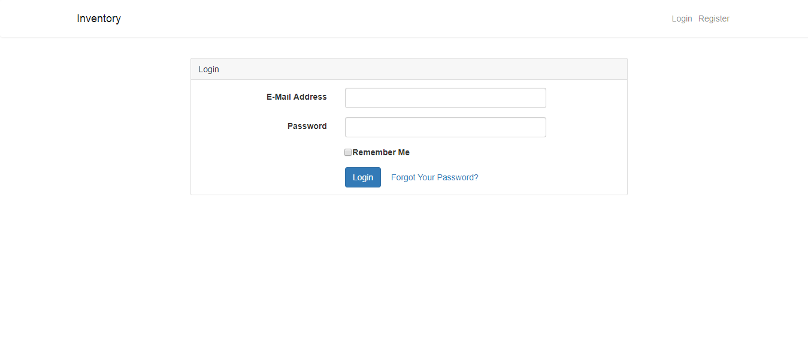
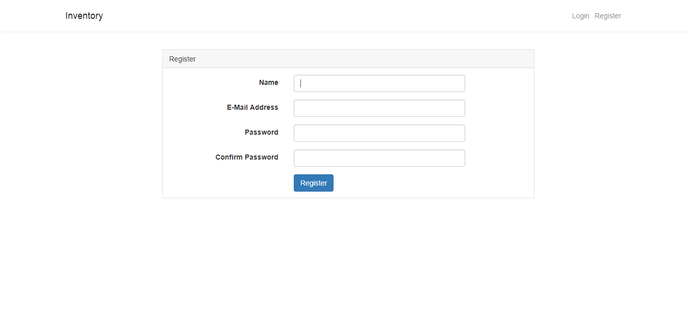
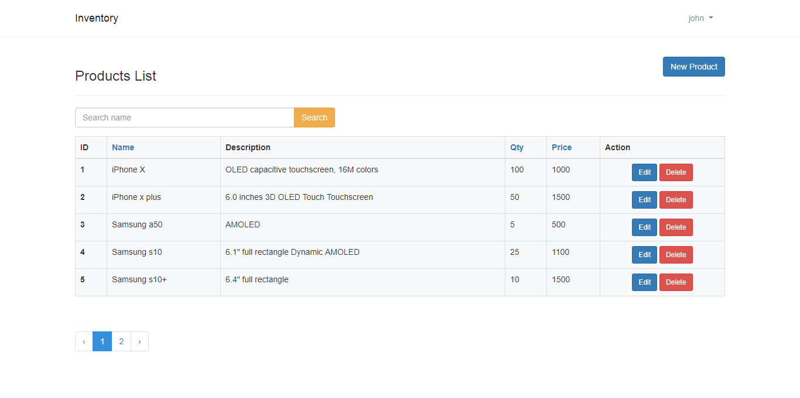
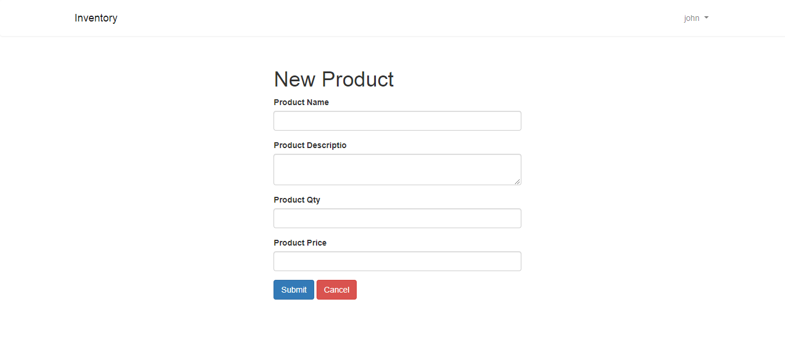
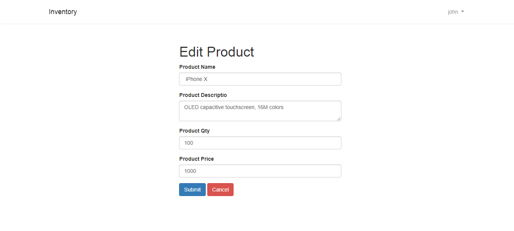

# Inventory Test Project.
Please Update database credential in .env.example and rename .env.example to .env

Execute composer install command.

Execute *php artisan migrate* command to migrate database.

Run website using [http://127.0.0.1/inventory](http://127.0.0.1/inventory).

Signup using [http://127.0.0.1/inventory/register](http://127.0.0.1/inventory/register).

Login using [http://127.0.0.1/inventory/login](http://127.0.0.1/inventory/login).

Check product list using [http://127.0.0.1/inventory/products](http://127.0.0.1/inventory/products).

Create product using [http://127.0.0.1/inventory/products/create](http://127.0.0.1/inventory/products/create).

# Screenshots
Home page

Login page

Registration page

Product Listing page

Create Product page

Edit Product page

